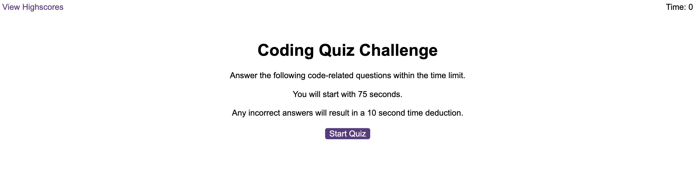

# Code Quiz

## Description

The aim is to provide a multiple choice quiz on the topic of coding that runs in the browser.

It features HTML files for the questions element and scores element, along with a CSS file for styling. It is powered by JavaScript code to give its functionality, with additional files for the questions element and scores element.

It has a clean and polished user interface that is responsive, ensuring that it adapts to multiple screen sizes.

The project involved updating the HTML structure and writing the JavaScript code to give the application its functionality, with attention paid to using functions effectively, position of variables and ease of future use.

## Installation

n/a

## Usage

The webpage has a start screen, from which the scoreboard can be accesssed directly, displaying any locally stored scores or an alternative message if there are no scores.

Once the user has clicked to start the quiz, they run through the quiz questions in order, selecting from four options (A-D) each time.

The timer starts at 75 at reduces at 1 second intervals.

When a correct answer is selected, the user is given a positive feedback message and a positive sound is played. A point is added to the user score for each correct answer.

When an incorrect answer is selected, the user is given a negative feedback message and a negative sound is played. 10 seconds are deducted from the time remaining for each incorrect answer.

The quiz ends when all questions have been answered or when the timer remaining has reached 0.

When the quiz ends, the user has the option to enter their initials for their initials and score to be displayed on the scoreboard.

The scoreboard displays the scores, with corresponding user initials, in descending order.

There is a button the user can click to clear the scoreboard of all stored user scores.

Screenshot: 

Website: https://louise-elliott-work.github.io/code-quiz

## License

This project is MIT licensed.